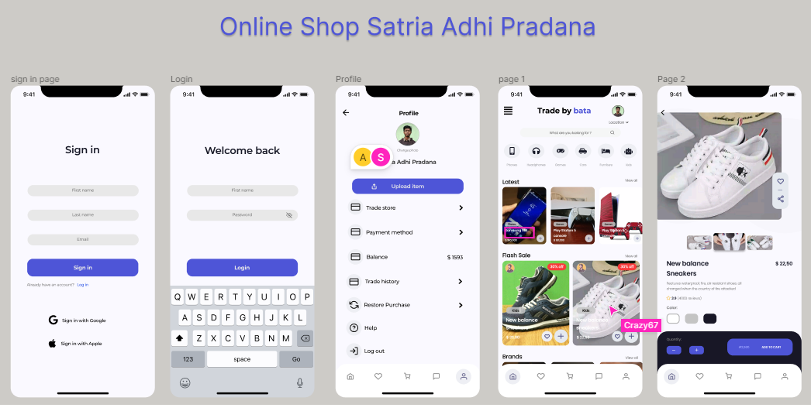
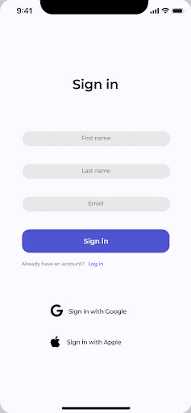
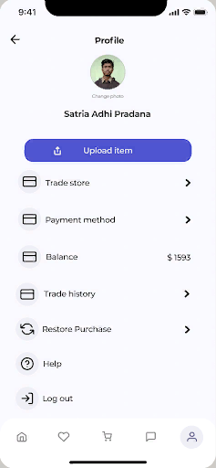
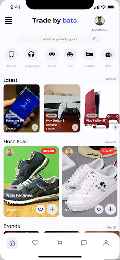
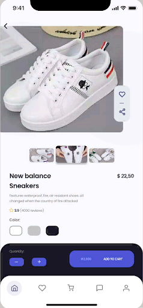

# Тестовое задание: приложение для интернет-магазина

***Внимание**** *- все используемые в реализации API предоставлены автором ТЗ, являются заглушками и в любой момент
могут быть свернуты*

## Используемые технологии
Kotlin, Корутины, Flow, MVVM, Clean Architecture, Многомодульность, DataStore, Room, Retrofit2, Hilt, Glide, Viewpager2, Navigation, 

## Результат
Реализованы все требования ТЗ, включая необязательные. Разделение на модули выполнено в двух вариантах:
- [***app, domain, data*** - *в ветке master*](https://github.com/PoddubniySerg/TradeByBata.git)
- [***разделение по функциям(app, core, data, feature1...featureN)*** - *в ветке feature-modules*](https://github.com/PoddubniySerg/TradeByBata/tree/feature-modules)

[Демонстрация реализации](#демонстрация-реализации)

[Teхническое задание](#техническое-задание)
1. [Общая информация](#общая-информация)
2. [Описание экранов](#описание-экранов)
   - [Экран «Sign in page» и экран «Login»](#экран-sign-in-page-и-экран-login)
   - [Экран «Profile»](#экран-profile)
   - [Экран «Page 1»](#экран-page-1)
   - [Экран «Page 2»](#экран-page-2-выполнение-по-возможности)
   
## Демонстрация реализации:

<table>
  <tr>
    <th width="25%">Валидация поля email, создание нового аккаунта</th>
    <th width="25%">Проверка существующего пользователя, вход по логину (валидация пароля отключена)</th>
    <th width="25%">Главная страница, поиск с подсказками, детализация информации о товаре</th>
    <th width="25%">Профиль пользователя, загрузка фото, удаление данных пользователя при выходе</th>
  </tr>
  <tr>
    <td align="center"></td>
    <td align="center"></td>
    <td align="center"></td>
    <td align="center"></td>
  </tr>
</table>

## Техническое задание

### Общая информация

- Дизайн всех элементов берем из прототипа в Figma:
  <table width="100%"><tr><td>
      
  </td></tr></table>

- Названия экранов в техническом задании соответствуют названию экранов в Figma
- Все шрифты, цвета и иконки можно брать из Figma
- **Важно!** Функционал, который помечен *«курсивом и звездочкой\*»* обязателен к реализации, а где цвет текста
  отмечен *~~зачеркнутым курсивом~~*, то реализация по возможности

### Описание экранов

#### *Экран «Sign in page» и экран «Login»*

<table>
  <tr>
    <th>Снимок экрана</th>
    <th>Описание элементов</th>
  </tr>
  <tr>
    <td>
      
    </td>
    <td>
      
Sign in

      <ul>
        <li>Заголовок экрана – брать со скрина</li>
        <li>Поле ввода имени – содержит placeholder «First name»</li>
        <li>Поле ввода фамилии – содержит placeholder «Last name»</li>
        <li>Поле ввода почты – содержит placeholder «Email»</li>
        <li>Кнопка для регистрации аккаунта – при нажатии на кнопку открывается Tab Bar и экран «page 1»</li>
        <li>Кнопка для входа в существующий аккаунт – перед кнопкой должен быть написан текст, уточняющий есть ли у пользователя аккаунт, далее сама кнопка. При ее нажатие осуществляется переход на экран «Login»</li>
        <li>Кнопка для авторизации через Google – слева иконка компании, справа текст, действие при нажатии на кнопку можно не прописывать</li>
        <li>Кнопка для авторизации через Apple – слева иконка компании, справа текст, действие при нажатии на кнопку можно не прописывать</li>
      </ul>
      
<i>
          ПРИМЕЧАНИЕ:
          При вводе почты нужно проверить валидность введенных данных. То есть нужно, чтобы написанное пользователем соответствовало некому шаблону, чтобы точно убедиться, что введенные данные это Email. В случае если написанное это не почта, то выдать ошибку валидации. 
          Например: jack-hofman10 – неверно, jack-hofman10@mail.ru – верно.
      </i>

    </td>
  </tr>
  <tr>
    <td>
      
    </td>
    <td>
      
Login

      <ul>
        <li>Заголовок экрана – брать со скрина</li>
        <li>Поле ввода имени – содержит placeholder «First name»</li>
        <li>Поле ввода пароля и кнопка видимости - содержит placeholder «Password». Кнопка видимости располагается справа в поле и по умолчанию имеет состояние «невидимый»</li>
        <li>Кнопка для входа в аккаунт – при нажатии на кнопку открывается Tab Bar и экран «page 1»</li>
      </ul>
    </td>
  </tr>
</table>

Сценарии использования:

- *Пользователь запускает мобильное приложение. Открывается начальный экран авторизации «sign in page»**
- *Если у пользователя уже есть аккаунт, то он нажимает кнопку «log in», которая находится под кнопкой «sign in».
  Открывается экран «Login», где пользователь вводит свои данные и нажимает кнопку «Login». Проверяется есть ли
  действительно такой аккаунт в базе данных. Если аккаунт есть в базе, то открывается Tab Bar и экран «Page 1», если
  такого пользователя не существует, то показывается соответствующая ошибка**
- *Если у пользователя нет аккаунта, то он вводит в соответствующие поля Имя, Фамилию, Email и нажимает кнопку «sign
  in». Введенные данные сохраняются локально в базу данных. Пользователь также может авторизоваться с помощью аккаунта
  Google или Apple (сделать только визуально). Открывается Tab Bar и экран «Page 1»**
- *Если пользователь не помнит, что уже регистрировался и вводит данные для регистрации, которые есть в базе данных, то
  показывается соответствующая ошибка об уже существующем пользователе с такими данными**

#### *Экран «Profile»*

<table>
  <tr>
    <th>Снимок экрана</th>
    <th>Описание элементов</th>
  </tr>
  <tr>
    <td>
      
    </td>
    <td>
      <ul>
        <li>Выполнить верстку всех элементов как показано на скриншоте. Имя пользователя, баланс и остальные элементы берем со скриншота</li>
        <li>Кнопка для загрузки фотографии пользователя – при нажатии на кнопку можно загрузить фотографию пользователя</li>
        <li>Кнопка выхода из аккаунта пользователя – при нажатии выходит из аккаунта (открывается начальный экран «sign in page»)</li>
      </ul>
    </td>
  </tr>
</table>

Сценарии использования:

*Пользователь хочет посмотреть информацию в своем профиле**

- *Пользователь нажимает на иконку с контроллером «Profile» в Tab Bar, чтобы перейти на соответствующий экран**
- *На экране выводится вся доступная информация о профиле, управлении им и его настройки**

*Пользователь хочет выйти из профиля**

- *Пользователь находится на экране «Profile»**
- *Пользователь хочет выйти из профиля и нажимает на кнопку «Log out». Происходит лог аут и открывается начальный экран
  «sign in page»**

~~*Пользователь хочет обновить фотографию в профиле
(выполнение по возможности)*~~

- ~~*Пользователь находится на экране «Profile»*~~
-
~~*Нажимает на кнопку «Change photo», которая находится под фотографией пользователя. Открывается библиотека фотографий
телефона*~~
- ~~*Пользователь выбирает фотографию и загружает ее*~~
- ~~*Фотография пользователя обновляется*~~

#### *Экран «Page 1»*

<table>
  <tr>
    <th>Снимок экрана</th>
    <th>Описание элементов</th>
  </tr>
  <tr>
    <td>
      
    </td>
    <td>
      <ul>
        <li>Navigation Bar – состоит из кнопок меню слева, title по центру, справа фото пользователя и локацию под фото пользователя</li>
        <li>Поиск по интернет-магазину – это обычный поисковик по приложению для поиска товара.  Содержит placeholder, как на скриншоте</li>
        <li>Категории интернет-магазина – это карусель, при свайпе вправо/влево происходит скролл. Все иконки и их названия можно скачать из Figma</li>
        <li>Недавно просмотренные товары – это карусель, при свайпе вправо/влево происходит скролл. Сам блок начинается с названия блока (“Latest”) слева и кнопки просмотреть все (“View all”) справа. Далее каждый товар содержит в себе фото товара, категорию товара, название товара, цену товара и кнопку добавления в корзину. Расположить все элементы как на скриншоте</li>
        <li>Распродажа товаров – это карусель, при свайпе вправо/влево происходит скролл. Сам блок начинается с названия блока (“Flash sale”) слева и кнопки просмотреть все (“View all”) справа. Далее каждый товар содержит в себе фото товара, дисконт товара, категорию товара, название товара, цену товара, кнопку добавить в избранное и кнопку добавления в корзину. Расположить все элементы как на скриншоте</li>
        <li>Бренды – это карусель, при свайпе вправо/влево происходит скролл</li>
      </ul>
    </td>
  </tr>
</table>

- [API для недавно просмотренных товаров](https://run.mocky.io/v3/cc0071a1-f06e-48fa-9e90-b1c2a61eaca7)
- [API для распродажи товаров](https://run.mocky.io/v3/a9ceeb6e-416d-4352-bde6-2203416576ac)

*ПРИМЕЧАНИЕ:*

*Данные в блоке Latest и Flash Sale можно получить с помощью двух разных API, но обработка и дальнейшее отображение
данных на экране следует производить СТРОГО после того, когда были получены ВСЕ данные, другими словами, после
объединения полученных данных. Например: если пришли данные для Latest, но не пришли для Flash Sale, то отображение
данных в обоих блоках не происходит.*

Сценарии использования:

~~*Пользователь хочет найти товар через поисковик в приложении (выполнение по возможности)*~~

- ~~*Пользователь находится на экране «Page 1»*~~
- ~~*Пользователь вводит слово или часть слова, или одну букву в поле ввода поисковика. Спустя 1 секунду после прекращения ввода выполняется запрос на сервер по этому [API](https://run.mocky.io/v3/4c9cd822-9479-4509-803d-63197e5a9e19), где находятся слова*~~
- ~~*Если введенная строка пользователем совпадает со словами или с одним словом, которые были получены из запроса, то эти слова из запроса отображаются как подсказка (продолжение слова) в виде выпадающего списка под поисковиком*~~
- ~~*Если введенная строка не совпадает ни с одним словом из запроса, то ничего не отображать*~~

#### ~~*Экран «Page 2» (выполнение по возможности)*~~

<table>
  <tr>
    <th>Снимок экрана</th>
    <th>Описание элементов</th>
  </tr>
  <tr>
    <td>
      
    </td>
    <td><i><s>
      <ul>
        <li>Кнопка назад – элемент Navigation Controller, при нажатии возвращается на экран «Page 1»</li>
        <li>Фото товара – показывается по одной фотографии. Карусель, при свайпе вправо или влево меняется фотография и эта фотография выделяется в блоке «выбор фотографии» ниже сделать по возможности</li>
        <li>Выбор фотографии – возможность выбрать любую фотографию из трех, которая будет чуть-чуть больше остальных и соответственно выбранная фотография показывается в блоке «фото товара» выше. Сделать карусель по возможности</li>
        <li>Блок с кнопкой добавления в избранное и кнопкой поделиться – две кнопки, функционал реализовывать не нужно</li>
        <li>Блок с информацией о товаре – содержит в себе название товара, ниже описание, ниже рейтинг товара, ниже варианты расцветок товара, с возможностью их выбрать (для всех цветов будет отображаться один и тот же товар) и справа цена товара</li>
        <li>Блок с итогом – слева содержит кнопки плюс и минус, с помощью которых можно выбрать количество товара, справа кнопка добавления в корзину, но при изменении количества товара, цена, которая находится в кнопке, меняется</li>
      </ul>
    </s></i></td>
  </tr>
</table>

~~*[API для получения данных](https://run.mocky.io/v3/f7f99d04-4971-45d5-92e0-70333383c239)*~~

~~*Сценарии использования: пользователь хочет посмотреть детальную
информацию о товаре и сделать заказ
(выполнение по возможности)*~~

- ~~*При нажатии на товар в списке товаров в разделе «Flash Sale» пользователь переходит с экрана «Page 1» на экран «Page 2» для просмотра детальной информации о товаре*~~
- ~~*Пользователь просматривает фотографии товара*~~
- ~~*Пользователь выбирает цвет товара*~~
- ~~*Может добавить товар в избранное*~~
- ~~*Может поделиться выбранным товаром*~~
- ~~*Выбирает количество товара, от которого меняется итоговая сумма товара*~~
- ~~*Нажимает на кнопку «Add to cart» для добавления в корзину и оплаты товара. Открывается соответствующий экран (реализовывать экран и функционал не нужно)*~~
